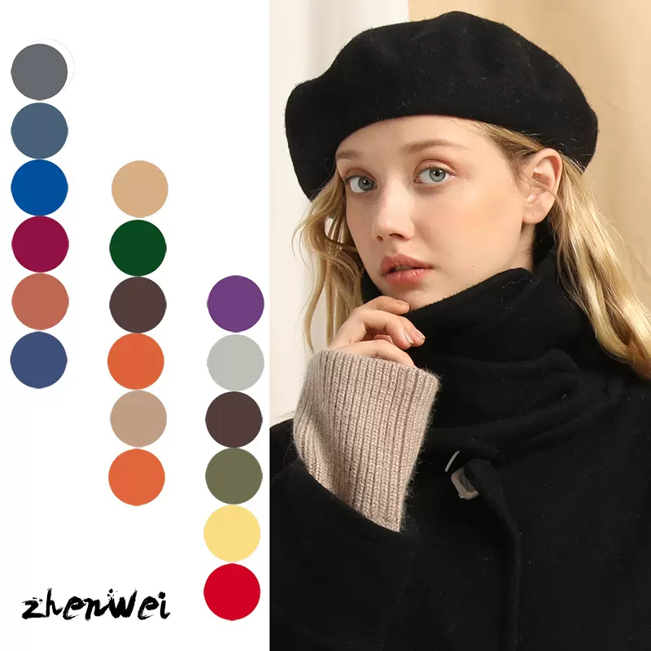
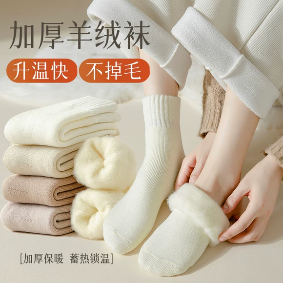
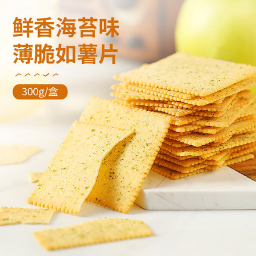
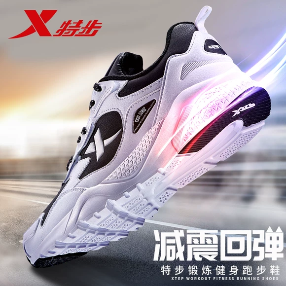
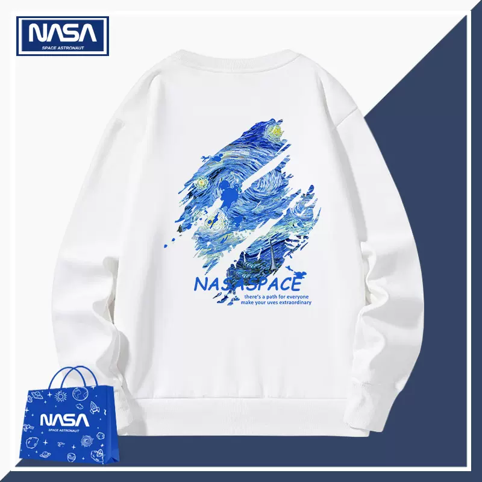
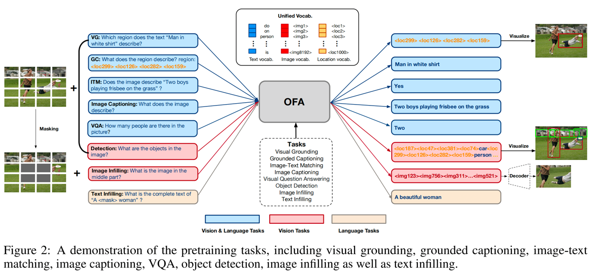

# Levels
Segment importance of hints seen by model to natural language token 'Levels'

# Abstract

This project was transformed based on OFA Chinese and challenged the **NICE (New frontiers for zero-shot Image Captioning Evaluation)** challenge 2023, resulting in **Track2 2nd/ Total 4th**. (**CVPR 2023 Workshop**)
NICE is an Image Captioning Task, which is a task to create appropriate captions for each photo provided by ShutterStock. Based on the intuition that the tone of caption in the NICE dataset feels unique, it was approached from the perspective of controlled dialogue generation.

본 프로젝트는 OFA Chinese를 기반으로 변형하여 **NICE(New frontiers for zero-shot Image Captioning Evaluation)** challenge 2023 를 도전하여 **Track2 2nd/ Total 4th**의 성과를 내었습니다. (**CVPR 2023 Workshop**)
NICE는 Image Captioning Task 로, ShutterStock 사에서 제공한 각 사진에 알맞는 캡션을 생성하는 과제입니다. NICE dataset 에서 나타나는 말투가 특이하게 느껴진다는 직관을 바탕으로, 이를 controlled dialogue generation 관점에서 접근하였습니다.

Editing :joy_cat::joy_cat::joy_cat:

# Quick Start 

Utilize preprocessed cosine similarities, trained models, etc.<br>
You can check the submission creating procedure, output captions of each photo, input data format looking through model inferencing code below.<br>

[](https://colab.research.google.com/github/calisolo/Levels_image_captioning_NICE/blob/master/NICE_quickstart.ipynb)


## Main task
- Since this approach is a methodology that connects the features of image captions with well-trained image encoder features, we utilized the open license model OFA, which has proven high performance.
- I wanted to create and train normalized hint level tokens so that the model could understand them.
- model checkpoint transition from fairseq style to huggingface style checkpoint, I refer to the code below and give credit.
- [Checkpoint transition](https://colab.research.google.com/drive/1LLJewY92LXdeug5m_ceMUHdlqrRQwSQJ?usp=sharing)
 fairseq style -> hf style
 
 
## Reproduce from scratch

### 0. Dataset characteristics & Preprocess
When looking at the groundtruth caption, there were many captions that explained the **format of the photo in the prefix** or described a **specific location**.
To identify trends, manually tagging was performed on 5000 cases as follows. (6-8 hours) 👷‍♂️👷‍♂️
|         caption_gt            | photo style prefix                                       | location at the caption                             |
|------------------------------|-----------------------------------------------------------|-----------------------------------------------------|
| Close up low angle view of Bicycles leaning against tree in wood| Close up low angle view of | NULL |
| View of town and bridge spanning river on sunny day Jarnac and the Charente river West Central France | View of | Jarnac and the Charente river West Central France|
| Sun beach and ocean at Gerrans Bay Cornwall United Kingdom | NULL |   Gerrans Bay Cornwall United Kingdom  |

[original validation set](https://github.com/calisolo/Levels_image_captioning_NICE/blob/master/data/nice-val-5k.csv) <br>
[tagged validation set](https://github.com/calisolo/Levels_image_captioning_NICE/blob/master/data/shotstyle_location%20worked.csv)
 
**Hypothesis**
1. Photos provided by the same supplier can be inferred through the information inherent in the image, and the subject/photo/caption method will be similar.
2. Public id is shutterstock's upload number, and it is highly likely that the photos uploaded consecutively have the same supplier.

=> Learning by using similarity between photos and public id provided in Validation_set
 
I use the NICE validation dataset as training data. The dataset consists of two files: caption data and image data. <br>
The training data consists of NICE validation data(5000 cases) and the test data consists of NICE test data (21377 cases). <br>
Caption data stores hints constructed based on id similarity and image cosine similarity, and **levels** meaning the strength of the hint.

<details>
<summary>(click!)How to make encoder_prefix (Input data format using Levels)</summary>
<br><br>
Based on the degree of similarity in the encoder part of the model, i tried to provide captions of several similar photos and hint levels using special tokens to show how similar the corresponding photos and the querying photo are.
Below are the criteria for judging the hint 'Levels'.

|     hint Levels(special tokens)  | Degree of hint effect                               | criterion                     |
|------------------------------|-----------------------------------------------------------|-----------------------------------------------------|
| [cosHint lv4] | Strong hints for nearly identical photos | cosine similarities >0.4 |
| [cosHint lv3] | Same topic but expected to have different captions | cosine similarities >0.32 |
| [cosHint lv2] | Similar photos but different captions | cosine similarities >0.29 |
| [cosHint lv1] | Irrelevant photos | cosine similarities ≤ 0.29 |
| [diffHint lv3] | The public_id difference between the photos is very small | id difference < 100 |
| [diffHint lv2] | The public_id difference between the photos is small  | id difference < 10000 |
| [diffHint lv1] | The public_id difference between the photos is large  | id difference ≥ 10000 |
 
The above hints were extracted from similar photos obtained based on cosine similarity, and the tagged shotstyles and locations were extracted from neighboring photos obtained based on id_difference.
<br><br>
</details>

caption data ，jsonl format：
```
{"image_id": "1813180760", "text": ["A vertical shot of sunset on a beach"], "encoder_prefix": "[cosHint lv3][diffHint lv1]A landscape shot of sunset at horizon over ocean[cosHint lv3][diffHint lv1]Sun beach and ocean at Gerrans Bay Cornwall United Kingdom[cosHint lv3][diffHint lv1]Vertical shot of a beautiful sunset over the sea[cosHint lv3][diffHint lv1]Sunrise near Los Islotes Baja California Sur Mexico"}
{"image_id": "1578946151", "text": ["A woman relaxing in a deck chair"], "encoder_prefix": "[cosHint lv3][diffHint lv2]A woman relaxing in a deck chair[cosHint lv3][diffHint lv1]Wide shot of a female in swimwear walking on the beach with an equipment bucket[cosHint lv3][diffHint lv1]A man meditating by a pool[cosHint lv2][diffHint lv1]Vertical shot of a woman in swimwear standing in water at the shore of a sunny beach"}
```

image data，tsv format (img_id, '\t', img_content)（base64 format）：
```
1813180760 /9j/4AAQSkZJRgABAQAAAQABAAD/2w...
1578946151 /9j/4AAQSkZJRgABAQAAAQABAAD/2w...
```
**preprocess** <br>
[](https://github.com/calisolo/Levels_image_captioning_NICE/blob/master/OFA_prepare_data.ipynb)
<br>

### 1. Make Tokenizer and Train at Colab

Create a tokenizer that adds special tokens representing the strength of the hint as levels.<br>
After adjusting 'train_args', put the picture and hint level into the encoder. Feed the image caption output into the decoder and start training to predict captions.

### environment
transformers==4.20.0

### training script
```
CUDA_VISIBLE_DEVICES=0 python train.py --train_args_file train_args/train_ofa.json
```


### Model Checkpoints
|         Model             | introduction                                              | Link                                               |
|------------------------------|-----------------------------------------------------------|-----------------------------------------------------|
| calisolo/OFA_huge_image_captioning| Optimized checkpoints for image captioning in the OFA-SYS | https://huggingface.co/calisolo/OFA_huge_image_captioning |
| calisolo/OFA_huge_NICE_captioning | One fine-tuned checkpoint with good progress when heuristically looked at | https://huggingface.co/calisolo/OFA_huge_NICE_captioning |
| submission 3 checkpoint       | need to be reproduced with following train_args          |       |
| submission 4 checkpoint    | need to be reproduced with following train_args        |     |
| Ensemble 1 checkpoint   | need to be reproduced with following train_args         |  |


## Code Details

### Repository structure
- data: Data (Cosine Similarities/ input data/ ground truth validation sets)
- images： input images (base64 format)
- component:
  - ofa:ofa model architecture
  - argument.py：train parameter
  - datacollator.py
  - dataset.py
- train_args：train parameter configuration
- vocab：tokenizer with 'Levels' token added
<br>

- convert_weight.py：Checkpoint transition/ but didn't found, didn't used   😿😿 
- generate.py: model generate example/ didn't used


## Cherry picked examples

| example                                          | submission 3 |  submission 4    |  submission 5 |
|---------------------------------------------|:-------------------------:|:---:|:------------------:|
|  |        精致小耳钉，点缀你的美        |  耳環,夾式耳環espritoutlet台北耳飾,耳環   |   小耳钉，让你的耳朵更有气质    |
|  |      精致锁骨链，点缀颈间的小性感       |  项链项链设计矢量矢量图素材第1页   |   精致锁骨链，彰显女性优雅气质   |
|  |       复古贝雷帽，演绎秋冬新时尚       |  帽子女秋冬新款韩版时尚百搭羊毛呢贝雷   |     针织开衫，温暖又时髦     |
|  |      复古眼镜框，戴出你的潮流范儿       |  戴眼镜的女生头像_www.qqya.com   |    黑色毛呢外套，时髦又显瘦    |
|  |    小清新手绘美甲，让你的指尖充满艺术感     |  美甲图片大全可爱图片_www.qqya.com   |   美甲指甲油，让你的指甲更美丽   |
|  |      高颜值口红，让你的唇色更加诱人      |  香奈儿chanel香奈兒香水香氛系列香水禮盒香   |    高颜值口红，让你爱不释手    |
|  |       高颜值美妆蛋，打造精致妆容       |  日本canmake井田蜜粉饼控油定妆持久遮瑕控油   |  高颜值美妆蛋，轻松打造气质女神   |
|  |       化妆刷选的好，妆容没烦恼        |  日本muji无印良品润唇膏保湿滋润唇部护理   |  秋冬季节，你需要一款好看的眼影盘  |
|  |       时尚百褶裙，让你美出新高度       |  百褶裙半身裙女秋冬2020新款韩版高腰a字   | 时尚百搭的半身裙，让你轻松穿出女神范 |
|  |       尖头高跟鞋，穿出优雅女人味       |  shoesirizachristianlouboutin   |  时尚尖头高跟鞋，穿出优雅女人味   |
|  |    加厚纯棉袜子女，冬季中筒袜学生堆堆袜     |  加厚羊绒袜子女中筒袜冬季加绒保暖棉袜   |    加厚羊绒袜，保暖又舒适     |
|  |        吊带连衣裙，清凉一夏         |  日系小清新甜美可爱少女系学院风小红裙   |   一字肩连衣裙，穿出女神范儿    |
|  |       内衣套装，给你贴心的呵护        |  红色背景上的女性手拿着一个红色的大象   | 红色婚庆用品，让你的婚礼更有仪式感  |
|  |      儿童毛绒玩具，陪伴宝宝快乐成长      |  【震撼精品百貨】mickymouse_米奇米妮~   |  可爱卡通毛绒玩具，萌化你的少女心  |
|  |     烟台红富士苹果，脆甜多汁，香甜可口     |  山东烟台栖霞红富士苹果新鲜水果当季整   |    新鲜水果，让你爱不释手     |
|  |      草莓奶油蛋糕，满足你的少女心       |  草莓奶油蛋糕图片   |   美味的生日蛋糕，让你爱不释手   |
|  |        手撕面包，营养又美味         |  面包包装盒设计   | 好吃到停不下来的手撕面包，你吃过吗？ |
|  |     香脆薄脆饼干，让你停不下来的美味      |  韩香海苔味薄脆加薯片休闲零食小吃膨化   |    美味零食，让你爱不释手     |
|  |      智能扫地机器人，让家更干净整洁      |  小米米家扫地机器人智能家用全自动吸尘   |  智能扫地机器人，让生活更有仪式感  |
|  |     苹果11promax，性价比超高      |  苹果11手机壳iphone11promax保护套硅胶全包边   |    高颜值手机，你值得拥有     |
|  |       智能洗衣机，洗出健康好生活       |  洗衣机图标隔离在白色背景上。3d渲染。   |  智能洗衣机，让你的生活更有仪式感  |
|  |    时尚充电宝，让你的手机充电更快更安全     |  小米移动电源10000毫安超大容量充电宝   |  高颜值充电宝，让你的手机充电更快  |
|  |       时尚运动鞋，让你运动更自信       |  特步专柜款男子夏季跑鞋17新品气垫减震   |  舒适跑步鞋，让你轻松跑出好身材   |
|  |      时尚潮流资讯，型男把妹约会夹克      |  男童外套春秋季新款韩版儿童夹克中大童   |   时尚潮流，型男原创休闲衬衫    |
|  |      时尚灵感指南，型男原创街拍卫衣      |  男士长袖t恤秋季新款韩版潮流宽松圆领   |  时尚灵感指南，型男原创潮流卫衣   |


## Reference

Backbone model 
- [OFA：Unifying Architectures, Tasks, and Modalities Through a Simple Sequence-to-Sequence Learning Framework](https://arxiv.org/pdf/2202.03052.pdf)  
- [OFA github](https://github.com/OFA-Sys/OFA)




codebase
- [OFA-Chinese github](https://github.com/yangjianxin1/OFA-Chinese) 
- [OFA-Chinese detail](https://mp.weixin.qq.com/s/thRbR1i6cZk8zUz3y2mq6g)

### Description of the OFA Chinese
- The OFA-sys official codebase has a high degree of complexity to be compatible with several experimental configurations. OFA Chinese is a huggingface version of the fine-tuning code that leaves only the core logic.


