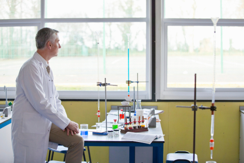
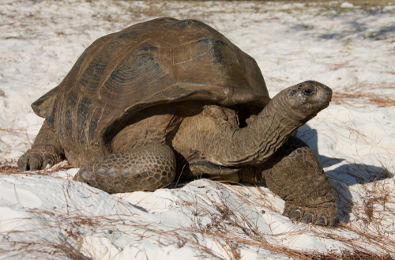
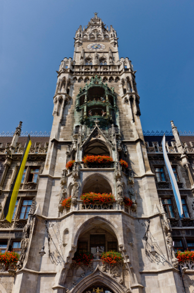

# Levels
Segment importance of hints seen by model to natural language token 'Levels'


## Abstract

This project was transformed based on OFA Chinese and challenged the **NICE (New frontiers for zero-shot Image Captioning Evaluation)** challenge 2023, resulting in **Track2 2nd/ Total 4th**. (**CVPR 2023 Workshop**)
NICE is an Image Captioning Task, which is a task to create appropriate captions for each photo provided by ShutterStock. Based on the intuition that the tone of caption in the NICE dataset feels unique, it was approached from the perspective of controlled dialogue generation.

본 프로젝트는 OFA Chinese를 기반으로 변형하여 **NICE(New frontiers for zero-shot Image Captioning Evaluation)** challenge 2023 를 도전하여 **Track2 2nd/ Total 4th**의 성과를 내었습니다. (**CVPR 2023 Workshop**)
NICE는 Image Captioning Task 로, ShutterStock 사에서 제공한 각 사진에 알맞는 캡션을 생성하는 과제입니다. NICE dataset 에서 나타나는 말투가 특이하게 느껴진다는 직관을 바탕으로, 이를 controlled dialogue generation 관점에서 접근하였습니다.


  

📖[English technical report](https://github.com/calisolo/Levels_image_captioning_NICE/blob/master/NICE/NICE%20-%20calisolo%20-%20eng.pdf)<br>
📖[Korean technical report](https://github.com/calisolo/Levels_image_captioning_NICE/blob/master/NICE/NICE%20-%20calisolo%20-%20kor.pdf)

## Quick Start 

Utilize preprocessed cosine similarities, trained models, etc.<br>
You can check the submission creating procedure, output captions of each photo, input data format looking through model inferencing code below.<br>

[](https://colab.research.google.com/github/calisolo/Levels_image_captioning_NICE/blob/master/Levels_quickstart.ipynb) 


## Main task
- Since this approach is a methodology that connects the features of image captions with well-trained image encoder features, we utilized the open license model OFA, which has proven high performance.
- I wanted to create and train normalized hint level tokens so that the model could understand them.
- model checkpoint transition from fairseq style to huggingface style checkpoint, I refer to the code below and give credit.
- [Checkpoint transition](https://colab.research.google.com/drive/1LLJewY92LXdeug5m_ceMUHdlqrRQwSQJ?usp=sharing)
 fairseq style -> hf style
 
 
# Reproduce from scratch

## 0. Dataset characteristics & Preprocess
When looking at the groundtruth caption, there were many captions that explained the **format of the photo in the prefix** or described a **specific location**.
To identify trends, manually tagging was performed on 5000 cases as follows. (6-8 hours) 👷‍♂️👷‍♂️
|         caption_gt            | photo style prefix                                       | location at the caption                             |
|------------------------------|-----------------------------------------------------------|-----------------------------------------------------|
| Close up low angle view of Bicycles leaning against tree in wood| Close up low angle view of | NULL |
| View of town and bridge spanning river on sunny day Jarnac and the Charente river West Central France | View of | Jarnac and the Charente river West Central France|
| Sun beach and ocean at Gerrans Bay Cornwall United Kingdom | NULL |   Gerrans Bay Cornwall United Kingdom  |

🚋[original validation set](https://github.com/calisolo/Levels_image_captioning_NICE/blob/master/data/nice-val-5k.csv) <br>
🚆[tagged validation set](https://github.com/calisolo/Levels_image_captioning_NICE/blob/master/data/shotstyle_location%20worked.csv)
 
**Hypothesis**
1. Photos provided by the same supplier can be inferred through the information inherent in the image, and the subject/photo/caption method will be similar.
2. Public id is shutterstock's upload number, and it is highly likely that the photos uploaded consecutively have the same supplier.

=> Learning by using similarity between photos and public id provided in Validation_set
 
I use the NICE validation dataset as training data. The dataset consists of two files: caption data and image data. <br>
The training data consists of NICE validation data(5000 cases) and the test data consists of NICE test data (21377 cases). <br>
Caption data stores hints constructed based on id similarity and image cosine similarity, and **levels** meaning the strength of the hint.


<details>
<summary>(click!)How to make encoder_prefix (Input data format using Levels)</summary>
<br><br>
Based on the degree of similarity in the encoder part of the model, i tried to provide captions of several similar photos and hint levels using special tokens to show how similar the corresponding photos and the querying photo are.
Below are the criteria for judging the hint 'Levels'.

|     hint Levels(special tokens)  | Degree of hint effect                               | criterion                     |
|------------------------------|-----------------------------------------------------------|-----------------------------------------------------|
| [cosHint lv4] | Strong hints for nearly identical photos | cosine similarities >0.4 |
| [cosHint lv3] | Same topic but expected to have different captions | cosine similarities >0.32 |
| [cosHint lv2] | Similar photos but different captions | cosine similarities >0.29 |
| [cosHint lv1] | Irrelevant photos | cosine similarities ≤ 0.29 |
| [diffHint lv3] | The public_id difference between the photos is very small | id difference < 100 |
| [diffHint lv2] | The public_id difference between the photos is small  | id difference < 10000 |
| [diffHint lv1] | The public_id difference between the photos is large  | id difference ≥ 10000 |
 
The above hints were extracted from similar photos obtained based on cosine similarity, and the tagged shotstyles and locations were extracted from neighboring photos obtained based on id_difference.
<br><br>
</details>

caption data ，jsonl format：
```
{"image_id": "1813180760", "text": ["A vertical shot of sunset on a beach"], "encoder_prefix": "[cosHint lv3][diffHint lv1]A landscape shot of sunset at horizon over ocean[cosHint lv3][diffHint lv1]Sun beach and ocean at Gerrans Bay Cornwall United Kingdom[cosHint lv3][diffHint lv1]Vertical shot of a beautiful sunset over the sea[cosHint lv3][diffHint lv1]Sunrise near Los Islotes Baja California Sur Mexico"}
{"image_id": "1578946151", "text": ["A woman relaxing in a deck chair"], "encoder_prefix": "[cosHint lv3][diffHint lv2]A woman relaxing in a deck chair[cosHint lv3][diffHint lv1]Wide shot of a female in swimwear walking on the beach with an equipment bucket[cosHint lv3][diffHint lv1]A man meditating by a pool[cosHint lv2][diffHint lv1]Vertical shot of a woman in swimwear standing in water at the shore of a sunny beach"}
```

image data，tsv format (img_id, '\t', img_content)（base64 format）：
```
1813180760 /9j/4AAQSkZJRgABAQAAAQABAAD/2w...
1578946151 /9j/4AAQSkZJRgABAQAAAQABAAD/2w...
```

[](https://colab.research.google.com/github/calisolo/Levels_image_captioning_NICE/blob/master/Levels_prepare_data.ipynb)
<br>

## 1. Make Tokenizer and Train at Colab

Create a tokenizer that adds special tokens representing the strength of the hint as levels.<br>
After adjusting 'train_args', put the picture and hint level into the encoder. Feed the image caption output into the decoder and start training to predict captions.

### environment
transformers==4.20.0

### training script
```
CUDA_VISIBLE_DEVICES=0 python train.py --train_args_file train_args/train_ofa.json
```
[](https://colab.research.google.com/github/calisolo/Levels_image_captioning_NICE/blob/master/Levels_train_inference.ipynb)


### Model Checkpoints
|         Model             |                   introduction                                   | Link & how to make                         |
|------------------------------|-----------------------------------------------------------|-----------------------------------------------------|
| OFA captioning fit| Optimized checkpoints for image captioning in the OFA-SYS | https://huggingface.co/calisolo/OFA_huge_image_captioning |
| Submission3 |3rd submission| https://huggingface.co/calisolo/OFA_huge_NICE_captioning |
| Submission4 |4th submission| [/submission4](https://huggingface.co/calisolo/OFA_huge_NICE_captioning/tree/main/submission4)|
| Ensemble1 | Adjusting hyperparameters to adjust convergence speed |   [/candidate1_trainLess](https://huggingface.co/calisolo/OFA_huge_NICE_captioning/tree/main/candidate1_trainLess)    |
| Ensemble2 | Adjusting hyperparameters to adjust convergence speed |   [/candidate2_short](https://huggingface.co/calisolo/OFA_huge_NICE_captioning/tree/main/candidate2_short)     |
| Ensemble3 | Adjusting hyperparameters to adjust convergence speed |   [/candidate3_lastcoin](https://huggingface.co/calisolo/OFA_huge_NICE_captioning/tree/main/candidate3_lastcoin)     |

The final submission was created by voting on the five checkpoints above.

 
## 2. Results analysis and ensemble

At each checkpoint, the caption results for 21377 photos are obtained and compared, and the final result is selected by voting based on the cosine similarity of natural language.

you can check the results in every checkpoints<br>

[](https://colab.research.google.com/github/calisolo/Levels_image_captioning_NICE/blob/master/Levels_data_viewer.ipynb)

### Cherry picked results 👍

| example                                          | submission 3 |  submission 4    |  submission 5 (ensembled answer) |
|---------------------------------------------|:-------------------------:|:---:|:------------------:|
|  |    A couple sitting at a cafe table   |  A couple talking and drinking coffee   |   A couple talking over a cup of coffee   |
|  |  View of a colorful hot air balloon against blue sky Balloon Festival Albuquerque New Mexico USA  |  Low angle view of a colorful hot air balloon against blue sky Balloon Festival Albuquerque New Mexico USA |   View of a colorful hot air balloon against blue sky Balloon Festival Albuquerque New Mexico USA |
|  |  A happy couple holding keys with selective focus on the keys | Young couple holding keys with selective focus on the keys  |  A happy couple holding keys with selective focus on the keys |
|  | View to Forte Falcone Portoferraio Island of Elba Province of Livorno Tuscany Italy  | View to Sertigtal Davos Grisons Switzerland | View to Sertigtal Davos Grisons Switzerland|
|  |  High angle view of a young woman packing boxes| Rear view of young woman moving in carrying boxes down staircase  |  High angle view of a young woman packing boxes |
|  |  Heavy rain at Amazon River near Pevas Peru | Heavy rain at Amazon River near Panelas Brazil | Heavy rain at Amazon River near Panelas Brazil |
|  |  Portrait of a young man sitting on a railing and using a digital tablet in the street with a stop sign in the background | Portrait of a young man sitting on a railing and using a digital tablet under a stop sign | Young man sitting on a railing and using a digital tablet with a stop sign in the background |


### Randomly chosen results 🗽

| example                                          | submission 3 |  submission 4    |  submission 5 (ensembled answer) |
|---------------------------------------------|:-------------------------:|:---:|:------------------:|
|  |  Multi generation family jumping into the lake   | Wide shot of a family running over a wooden jetty to jump into the lake | Multi generation family running over a wooden jetty to jump into the lake |
|  | Horizontal shot of a standing businessman with clipboard leaning on a door and looking at the camera | Horizontal shot of a businessman with a folder standing in the corridor of an office building with copy space | Horizontal shot of a businessman with a folder standing in the corridor of an office building with copy space |
|  | Female chemistry teacher in laboratory classroom | Mature chemistry teacher conducting scientific experiment in laboratory classroom| Mature chemistry teacher looking out of the window in laboratory classroom |
|  | Portrait of a teenage couple  | Romantic Young Couple Kissing In Countryside Together | Portrait of a teenage couple |
|  | Wide shot of a windsurfer windsurfing on sunny windy waves | Silhouetted of a windsurfer windsurfing on sunny windy waves | Wide shot of a windsurfer windsurfing on sunny windy waves |
|  | Vertical shot of a teacher watching high school girls conducting scientific experiment on a plant during a biology class  | Vertical shot of a teacher watching a young boy and a girl conducting experiment on a plant during a biology class| Vertical shot of a teacher watching high school girls conducting scientific experiment on a plant during a biology class |
|  | Beach and a hotel at sunset Dischma Valley Davos Graubuenden Grisons Switzerland  | Beach of Biarritz France | Beach of Isla Magdalena Baja California Sur Mexico|
|  | Portrait shot of a young boy holding a fishing net at the beach with his family in the background | Portrait shot of a young boy holding a fishing net on a lake with his family in the background  | Portrait shot of a young boy holding a fishing net with his family in the background |
|  | Aldabra giant tortoise Aldabra Atoll Seychelles    | Aldabra giant tortoise Aldabra Atoll Seychelles | Aldabra giant tortoise Aldabra Atoll Seychelles |
|  | Cactus at Mount Teide Teide National Park Tenerife Canary Islands Spain | Cactus at Mount Teide Teide National Park Tenerife Canary Islands Spain | Cactus at Mount Teide Teide National Park Tenerife Canary Islands Spain |
|  | Riverside of Amazon River near Panelas Brazil | Riverside of Amazon River near Uara Brazil | Riverside of Amazon River near Uara Brazil |
|  | A medium shot of a group of people looking at a computer in an office | A medium shot of a group of people standing and sitting around a computer in office | A medium shot of a group of people standing and sitting around a computer in office|
|  | Vertical shot of a middle school student reading sheet music and playing a saxophone with a music teacher playing piano in the foreground | Vertical shot of a high school student playing a saxophone with a music teacher playing piano in the foreground | Vertical shot of a middle school student playing a saxophone in a music class with a music teacher playing piano in the foreground |
|  | Beekeeper using smoker to check beehives in field full of flowers | Beekeeper using smoker to check beehives in the field full of flowers | Beekeeper using smoker to check beehives in the field full of flowers |


### Is hint Levels working? 🎚️
| example                                     | most similar picture(from valid set) |  shot_style near example    |  location near example |
|---------------------------------------------|:-------------------------:|:---:|:------------------:|
|  |    | A side profile Close up shot of, A portrait shot of , A Close up vertical shot of , A medium shot of  |  NULL  |
|  |   |  View of , Close up of | [diffHint lv3]Prague,[diffHint lv3]Prague,[diffHint lv3]Germany,[diffHint lv3]The Alps Graubunden Switzerland   |
|  |   | Portrait of , Portrait |  NULL   |
|  |   | View to  |  [diffHint lv3]Prattigau near Davos Grisons Switzerland,[diffHint lv3]Prattigau near Davos Grisons Switzerland ,[diffHint lv3]Davos Grisons Switzerland,[diffHint lv3]Davos and Dischmatal,[diffHint lv2]Mediterranean Sea Malta |

YES IT IS! 😸

## Code Details

### Repository structure
- data: Data (Cosine Similarities/ input data/ ground truth validation sets)
- images： input images (base64 format)
- component:
  - ofa:ofa model architecture
  - argument.py：train parameter
  - datacollator.py
  - dataset.py
- train_args：train parameter configuration
- vocab：tokenizer with 'Levels' token added
<br>

- convert_weight.py：Checkpoint transition/ but didn't found, didn't used   😿😿 
- generate.py: model generate example/ didn't used


## Reference

Backbone model 
- [OFA：Unifying Architectures, Tasks, and Modalities Through a Simple Sequence-to-Sequence Learning Framework](https://arxiv.org/pdf/2202.03052.pdf)  
- [OFA github](https://github.com/OFA-Sys/OFA)


codebase
- [OFA-Chinese github](https://github.com/yangjianxin1/OFA-Chinese) 
- [OFA-Chinese detail](https://mp.weixin.qq.com/s/thRbR1i6cZk8zUz3y2mq6g)

### Description of the OFA Chinese
- The OFA-sys official codebase has a high degree of complexity to be compatible with several experimental configurations. OFA Chinese is a huggingface version of the fine-tuning code that leaves only the core logic.

